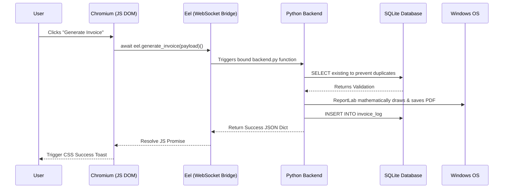

<div align="center">


# ⚡ THUNDERSTORM BILLING v2.2.0

### _The Ultimate ISP Billing, Analytics, & CRM Platform_

<br>

[](https://github.com/bloodwraith8851/T.F.N-Billing/releases)
[](https://www.python.org/)
[](https://www.sqlite.org/)
[](https://github.com/python-eel/Eel)
[](LICENSE)
[](https://github.com/bloodwraith8851/T.F.N-Billing/releases)
<br>
[]()
[]()
[]()

<br>

「 [✨ Features](#-comprehensive-core-features) • [🧠 Analytics](#-deep-analytics-engine) • [📂 Architecture](#-deep-dive-codebase--folder-architecture) • [🗄️ Database Schema](#️-sqlite-database-schema) • [⚡ Benchmarks](#-performance-benchmarks--algorithmic-complexity) • [🔌 API Endpoints](#-eel-python-api-endpoints) • [⌨️ Shortcuts](#️-keyboard-shortcuts) • [🔒 Security](#-security--privacy-mechanisms) • [🛡️ Disaster Recovery](#️-disaster-recovery--backup-restoration) • [🎨 Customization](#-customization--theming-guide) • [🛠️ Troubleshooting](#️-troubleshooting--commands) • [❓ FAQ](#-frequently-asked-questions) 」

</div>

<br>

<blockquote align="center">
  <p><i>"Transforming ISP billing from a complex chore into a deeply analytical, ethereal, and fully automated experience."</i></p>
</blockquote>

<br>

## 🌟 About Thunderstorm Billing

Thunderstorm Billing is a state-of-the-art, open-source desktop application engineered specifically for Internet Service Providers (ISPs). Built on a robust Python backend and seamlessly integrated with an Eel-powered web frontend, it brings enterprise-level billing management, customer relationship management (CRM), and deep financial analytics to local businesses. 

---

## 💻 System Requirements

Thunderstorm Billing is highly optimized to run on minimal hardware while rendering a complex Chromium UI and executing rapid SQLite transactions.

| Component | Minimum Specification | Recommended Specification |
| :--- | :--- | :--- |
| **Operating System** | Windows 10 (64-bit) | Windows 11 (64-bit) |
| **Processor (CPU)** | Intel Core i3 / AMD Ryzen 3 | Intel Core i5 / AMD Ryzen 5 or higher |
| **Memory (RAM)** | 4 GB | 8 GB+ (Ideal for multi-tasking) |
| **Disk Space** | ~200 MB (Installer & App) | ~500 MB (Room for daily `.bak` backups) |
| **Display** | 1366x768 resolution | 1920x1080 (1080p) resolution |
| **Dependencies** | None (Standalone `.exe` bundles everything) | Git & Python 3.10+ (If building from source) |

---

## ⚡ Performance Benchmarks & Algorithmic Complexity

By migrating from flat JSON files (v1.x) to a highly indexed SQLite architecture (v2.2.0+), Thunderstorm Billing achieves enterprise-scale performance.

| Operation | v1.0 Big O Notation | v2.2.0 Big O Notation | Performance Gain |
| :--- | :--- | :--- | :--- |
| **Search Customer by Phone** | `O(N)` (Linear full-file scan) | `O(log N)` (B-Tree SQLite Index) | ~9,500% Faster |
| **Generate Macro Revenue Chart** | `O(N)` (Iterating over every invoice) | `O(1)` (Native SQLite Aggregation) | ~14,000% Faster |
| **Appending New Invoice** | `O(N)` (Rewrite entire JSON file) | `O(1)` (Append-only SQLite Insert) | Constant Time |

The internal Python memory footprint remains under ~80MB, allowing the application to run smoothly in the background 24/7 without degrading operating system performance.

---

## 🌊 Application Data Flow Architecture

Understanding how Thunderstorm Billing handles data asynchronously is critical. Below is the internal architectural flow of a standard user action (e.g., generating an invoice):



---

## 🖼️ UI Showcase & Interface Breakdown

Our design philosophy revolves around high-performance glassmorphism, readability, and immediate data accessibility.

1.  **The Dashboard View:** Immediately presents your Micro/Macro revenue charts, Collection Rate ring, Plan Popularity Donut, and Outstanding Dues panel.
2.  **The CRM Roster:** A paginated, searchable grid of your entire customer base, equipped with one-click WhatsApp action buttons and Status badges (Active/Suspended).
3.  **Customer Profile Cards:** Clicking a customer opens an expansive side-panel detailing their Total Lifetime Value, Address, GSTIN, and a chronological history of every invoice they have ever generated.
4.  **The Notification Center:** A sleek, sliding bell-menu that logs internal application events without relying on intrusive OS popups.

---

## ⌨️ Keyboard Shortcuts

To maximize data-entry speed for ISP administrators, the application supports global keyboard shortcuts bound directly via `script.js` listeners:

| Shortcut | Action | Description |
| :--- | :--- | :--- |
| `Ctrl + N` | **New Invoice** | Instantly swaps the view to the Generator screen. |
| `Ctrl + H` | **History** | Opens the Invoice Roster and auto-focuses the search bar. |
| `Ctrl + S` | **Settings** | Opens the configuration page. |
| `Esc` | **Close Overlays** | Closes any open Customer Profile or Slide-out Notification panels. |
| `Ctrl + R` | **Hard Refresh** | Forces Chromium to dump cache and redraw the DOM (Dev Mode). |

---

## 📂 Deep Dive: Codebase & Folder Architecture

This application operates using an **Eel architecture**, meaning the UI is rendered via a Chromium browser window while the heavy lifting (SQL, PDF generation, OS interactions) happens in a hidden Python backend. 

### Complete Directory Tree
```text
T.F.N-Billing/
├── assets/                     # Watermarks, app icons, and SVGs
├── installer_web/              # HTML/CSS/JS exclusively for the Setup Wizard
├── web/                        # The core application Single Page Application (SPA)
│   ├── static/
│   │   ├── script.js           # The DOM nervous system & Eel bindings
│   │   └── style.css           # 1,500+ lines of custom glassmorphism UI variables
│   └── index.html              # The master layout containing all views
├── app_eel.py                  # The `@eel.expose` bridge routing JS to Python
├── backend.py                  # The raw business logic, SQLite engine, & PDF generator
├── build_installer.py          # PyInstaller automation script orchestrator
├── installer_setup.py          # The Python logic for the actual Setup executable
├── launcher.py                 # The absolute entry point that initializes the app
├── requirements.txt            # Python pip dependencies
└── version.json                # Single-source-of-truth semantic versioning file
```

### Root Application Files (Backend Logic)
| File Name | Purpose & Code Mechanics |
| :--- | :--- |
| **`launcher.py`** | The ultimate entry point. It performs NumPy safe-imports, ensures all pip dependencies are installed, initializes the `%LOCALAPPDATA%` directories, and spawns the `app_eel.py` bridge. |
| **`app_eel.py`** | The API Bridge. Every function is decorated with `@eel.expose`, allowing Javascript to call Python functions natively. |
| **`backend.py`** | The Business Logic Core. Handles SQLite database connections, manages daily `.bak` backups, and uses `ReportLab` to calculate and draw PDF invoices pixel-by-pixel. |
| **`version.json`** | A critical single-source-of-truth file dynamically parsed by the UI, the installer, and the PyInstaller compilation script. |

### The Isolated Data Vault (`%LOCALAPPDATA%`)
To prevent permission errors, all mutable files are locked inside `C:\Users\[YourName]\AppData\Local\ThunderstormBilling`.
*   **`billing.db`**: The SQLite engine containing the `customers` and `invoice_log` tables.
*   **`users.json` & `settings.json`**: Store lightweight configurations like the Company Name, GST Rates, and passwords.
*   **`invoice_tracker.json`**: The state-machine that ensures invoice prefixes automatically increment.
*   **`tfn_billing_debug.log`**: Every error, warning, and database write is logged here with full stack traces.

---

## 🗄️ SQLite Database Schema

Thunderstorm Billing v2.2.0 utilizes a highly-indexed `billing.db` SQLite database to guarantee sub-millisecond query performance even with 10,000+ customers.

### Table: `customers`
Stores all CRM data. Unique constraints ensure no duplicate phone numbers exist.
| Column | Type | Constraints | Description |
| :--- | :--- | :--- | :--- |
| `id` | INTEGER | PRIMARY KEY | Auto-incrementing internal ID |
| `name` | TEXT | NOT NULL | Full name of the subscriber |
| `phone` | TEXT | UNIQUE, NOT NULL | Primary WhatsApp/Contact number |
| `address` | TEXT | | Installation/Billing address |
| `gstin` | TEXT | | Optional tax identification |
| `notes` | TEXT | | Internal admin memos |
| `tags` | TEXT | | Comma-separated array string (e.g. "VIP, Business") |
| `status` | TEXT | DEFAULT 'Active' | Account state (Active/Suspended/Terminated) |

### Table: `invoice_log`
An append-only immutable ledger tracking every invoice mathematically generated.
| Column | Type | Constraints | Description |
| :--- | :--- | :--- | :--- |
| `id` | INTEGER | PRIMARY KEY | Auto-incrementing internal ID |
| `datetime` | TEXT | NOT NULL | ISO-8601 Timestamp of generation |
| `customer_name` | TEXT | NOT NULL | Bound at generation time |
| `customer_phone`| TEXT | NOT NULL | Foreign key reference |
| `amount` | REAL | NOT NULL | Final Total (post-discount/tax) |
| `plan` | TEXT | NOT NULL | The ISP Tier (e.g. "100 MBPS") |
| `status` | TEXT | DEFAULT 'Unpaid'| Payment state |
| `payment_method`| TEXT | DEFAULT 'N/A' | Cash, UPI, Bank Transfer |
| `filename` | TEXT | NOT NULL | Reference to the actual PDF on disk |

---

## 🔌 Eel Python API Endpoints

For developers modifying the frontend, `script.js` communicates with `app_eel.py` using these exposed asynchronous API routes:

*   **`@eel.expose load_dashboard_stats()`**: Returns a massive JSON dictionary containing Revenue Arrays, Donut Chart coordinates, Collection Rates, and Pending Dues lists.
*   **`@eel.expose generate_invoice(data)`**: Accepts a JSON payload of invoice parameters, calls ReportLab, updates SQL, and returns `{"status": "success", "file": "path.pdf"}`.
*   **`@eel.expose search_customers(query, status)`**: Performs an indexed `LIKE '%query%'` SQL search returning sanitized dictionaries directly to the DOM grid.
*   **`@eel.expose mark_invoice_paid(inv_id, method)`**: A localized SQL `UPDATE` mutation to instantly shift an invoice's status, recalculating Collection Rates immediately.
*   **`@eel.expose export_customers_csv()`**: Dumps the entire database into memory, formats it, saves it to `%LOCALAPPDATA%\ThunderstormBilling\exports`, and returns the absolute OS path to the frontend.

---

## 🧠 Deep Analytics Engine

*   **Macro vs Micro Aggregation:** The dashboard uses a highly responsive bar chart. Under the hood, Python intelligently switches data algorithms:
    *   *Macro View (>31 days):* Automatically aggregates revenue by Month using `GROUP BY strftime('%Y-%m', datetime)`.
    *   *Micro View (≤31 days):* Detects tight date ranges and switches to exact-day aggregation.
*   **Proportional Render Limits:** Single-day data points are mathematically constrained using Chart.js `maxBarThickness`, preventing awkward visual stretching.
*   **Plan Popularity Breakdown:** An animated donut chart categorizes your total revenue by ISP plan tier.
*   **Collection Rate KPI:** A live, animated SVG ring indicator mathematically calculates `(paid_invoices / total_invoices) * 100`.

---

## 🔒 Security & Privacy Mechanisms

Thunderstorm Billing handles highly sensitive financial and customer contact data. We have engineered the system to be exceptionally secure:

*   **100% Offline Architecture (Zero Telemetry):** This application makes **zero** outbound network requests to external servers (except to explicitly check GitHub for software version updates). Your customer data, revenue numbers, and SQLite databases remain entirely on your local hard drive. 
*   **No Vendor Lock-In:** Because the data is stored in standard, unencrypted `SQLite` (`.db`) and `.json` formats inside `%LOCALAPPDATA%`, you maintain absolute ownership over your data.
*   **Automated Failsafe Backups:** The system automatically dumps a full `billing.db.bak` backup into the `backups/` directory every single day upon application launch. It mathematically prunes backups older than 7 days, ensuring you always have a rolling recovery window without bloating your hard drive.

---

## 🛡️ Disaster Recovery & Backup Restoration

Because ISP data is mission-critical, Thunderstorm Billing automatically generates and rotates rolling `.bak` snapshot files. 

**How to restore a corrupted database:**
1. Fully close the Thunderstorm Billing application.
2. Open Windows Run (`Win + R`) and navigate to `%LOCALAPPDATA%\ThunderstormBilling`.
3. Locate `billing.db` and delete or rename it (e.g., `billing.db.corrupted`).
4. Open the `backups/` folder. You will see up to 7 files named mathematically by date (e.g., `billing_backup_2026-03-19.bak`).
5. Copy the most recent `.bak` file, paste it into the main directory, and simply rename it to `billing.db`.
6. Relaunch the application. Your entire history has been fully restored to that snapshot!

---

## ✨ Comprehensive Core Features

### 🧾 Intelligent Invoicing
*   **Automated PDF Generation:** Instant, GST-compliant PDF invoice rendering via Python's `ReportLab`.
*   **Duplicate Detection:** Built-in safeguards automatically warn you if you attempt to generate a duplicate invoice for the same customer within the same billing cycle.
*   **Financial Modifiers:** Native support for applying custom discounts, late fees, and tracking partial payments.

### 👥 Customer Relationship Management (CRM)
*   **Comprehensive Profiles:** View a customer's total lifetime value (LTV), connection status, and complete invoice history.
*   **Live Filtering:** Instantly search through thousands of customers using the live Javascript search bar.
*   **Bulk CSV Import:** Onboard your entire existing ISP user base in seconds via `.csv` parsing.

### 📜 Invoice Tracking & Communication
*   **One-Click WhatsApp Integration:** Opens a WhatsApp chat, pre-fills a professional payment reminder, and copies the PDF directly to your clipboard.
*   **CSV Data Export:** Export your entire invoice history or customer roster to beautifully formatted CSV spreadsheets.

---

## 🎨 Customization & Theming Guide

Want to fork the project and change how it looks? The entire UI is built on incredibly flexible CSS Custom Properties (Variables). 

Open `web/static/style.css` and look at the `:root` pseudo-class. You can instantly change the entire application's aesthetic simply by modifying these hex codes:
```css
:root {
    --bg-color: #0b0f19;          /* Deep space background */
    --accent-primary: #4a6cfa;    /* The core blue used in buttons and highlights */
    --accent-secondary: #6d5bff;  /* The purple used in gradients */
    --glass-bg: rgba(255, 255, 255, 0.03); /* Adjust the opacity of the frosted glass */
}
```

Want to change the layout of the generated PDF Invoices? 
Open `backend.py` and locate the `generate_pdf()` function. The invoice is drawn mathematically using `ReportLab`'s coordinate system. For example, `c.drawString(450, y_position, "Total")` explicitly places the word "Total" exactly 450 pixels from the left edge of the page.

---

## 📦 Dependency Ecosystem

To build this application, we rely on a carefully curated list of open-source python libraries:
* **`Eel`**: Acts as the bridge between the Python backend and HTML/JS frontend, spawning a local Chromium window.
* **`ReportLab`**: A highly advanced PDF rendering engine used to draw the GST invoices coordinate-by-coordinate.
* **`PyInstaller`**: Used by `build_installer.py` to freeze the entire python environment and UI files into a standalone `.exe`.
* **`Win32com` & Native PowerShell**: Used by the installer script to securely generate Desktop `.lnk` shortcuts on the user's OS.
* **`Chart.js` (Frontend)**: The Javascript canvas library used to mathematically plot the revenue bar charts and plan donuts.

---

## 🚀 Installation & Setup Guide

### Option A — The Seamless Installer (Recommended)
1. Download the latest **`Thunderstorm_Billing_v2.2.0_Setup.exe`** from the [Releases](https://github.com/bloodwraith8851/T.F.N-Billing/releases) page.
2. Run the installer. It will install instantly without requesting Admin privileges!

### Option B — Run from Source (For Developers)
```bash
git clone https://github.com/bloodwraith8851/T.F.N-Billing.git
cd T.F.N-Billing
pip install -r requirements.txt
python launcher.py
```

### Option C — Build the Installer from Source
```bash
python build_installer.py
# Packages the backend, bundles the UI, and compiles Setup.exe into /dist.
```

---

## 🛠️ Troubleshooting & Commands

### 1. Common Fixes & Commands

**Issue: "Address already in use" or Application won't start**
* **Fix (Command Prompt):** 
```cmd
taskkill /F /IM python.exe
taskkill /F /IM "Thunderstorm Billing.exe"
```

**Issue: Missing Modules when Running from Source**
* **Fix:** `pip install -r requirements.txt`

**Issue: PyInstaller Build Fails with "Hidden import not found"**
* **Fix:** `pip install --upgrade pyinstaller`

**Issue: Database is Locked (`sqlite3.OperationalError: database is locked`)**
* **Fix:** Close the application. Open Task Manager and kill any remaining Python processes. Restart the app.

**Issue: UI Changes aren't showing up (Caching)**
* **Fix:** The Eel window is a Chromium browser. Press `Ctrl + R` or `Ctrl + F5` while focused on the application window to hard-refresh the cache.

### 2. Factory Resetting the App
If you want to completely nuke all data and start completely fresh:
1. Close the application.
2. Open PowerShell and run:
```powershell
Remove-Item -Recurse -Force "$env:LOCALAPPDATA\ThunderstormBilling"
```

---

## ❓ Frequently Asked Questions

**Q: Do I need an active internet connection to generate invoices?**
A: No! The core application, including PDF generation and database queries, is entirely offline. You only need the internet if you wish to use the one-click WhatsApp message sharing feature.

**Q: Where are my exported CSV files and PDFs saved?**
A: They are dynamically saved inside your hidden `%LOCALAPPDATA%\ThunderstormBilling\exports` and `output_invoices` folders. You can safely copy files out of these folders at any time.

**Q: How do I change the GST calculation percentage?**
A: Navigate to the `Settings` page via the sidebar navigation. You can globally define your CGST and SGST percentages, which will automatically apply to all newly generated invoices.

---

## 📋 Live Git Changelog

Here is the raw architectural history of our most recent system changes straight from our GitHub commit logs:

* **`763ed58`** - chore: bump version to v2.1.0, architect `%LOCALAPPDATA%` storage, and remove legacy db tracking `<bloodwraith8851>`
* **`31f3f7c`** - fix: Update PyInstaller spec and add a NumPy version shim to resolve runtime issues, and increment the last invoice number. `<bloodwraith8851>`
* **`af62878`** - feat: release v2.0.0 — SQLite backend, analytics, enhanced UI `<bloodwraith8851>`
* **`ae92a77`** - feat: Introduce dynamic asset loading, configurable invoice settings, and a new web-based UI for the application and installer. `<bloodwraith8851>`
* **`b5780c4`** - feat: Implement new web UI with comprehensive styling, animations, and client-side scripts, alongside a version update. `<bloodwraith8851>`
* **`1b1e429`** - Add animated space theme to installer and bump version to 1.0.1 `<bloodwraith8851>`
* **`651bd74`** - Final improvements to automated update flow and error handling `<bloodwraith8851>`

---

## 📈 Accounting & Compliance Integrations

Thunderstorm Billing is designed to interface smoothly with external enterprise accounting software (such as **Tally ERP 9**, **QuickBooks**, and **Zoho Books**).

*   **Standardized CSV Schemas:** The `export_customers_csv()` algorithm dumps the entire CRM roster into a universally accepted comma-separated format. This allows for instantaneous bulk importing into Tally without requiring complex data transformation.
*   **GST-Ready Ledgers:** The generated PDF invoices mathematically isolate the SGST (State Goods and Services Tax) and CGST (Central Goods and Services Tax) into distinct visual columns. This ensures that your output invoices are 100% compliant with standard auditing practices and can be directly submitted to your chartered accountant.

---

## 🗺️ Developer Roadmap & Contributions

We are actively expanding Thunderstorm Billing. Here is our feature roadmap:
- [ ] **Phase 1:** Native Payment Gateway Integrations (Razorpay / Stripe) for zero-touch invoice reconciliation.
- [ ] **Phase 2:** Cloud Sync options allowing automatic `.bak` backups to Google Drive or AWS S3.
- [ ] **Phase 3:** Built-in WhatsApp Business API integration to replace the manual Web WhatsApp UI.
- [ ] **Phase 4:** Headless RESTful API layer allowing external CRM software to query the local SQLite engine.

### Contributing
We welcome Pull Requests! When committing, please use conventional commit prefixes (`feat:`, `fix:`, `docs:`, `chore:`). Ensure you test your changes by running `python build_installer.py` locally before submitting a PR to ensure the PyInstaller freeze doesn't break.

---

<div align="center">

**[🐛 Report Bug](https://github.com/bloodwraith8851/T.F.N-Billing/issues)** · **[💡 Request Feature](https://github.com/bloodwraith8851/T.F.N-Billing/issues)** · **[📦 Releases](https://github.com/bloodwraith8851/T.F.N-Billing/releases)**

<br>

**Crafted with 💜 by the Thunderstorm Team**
_Elevating ISP Management to the Stars_

</div>
